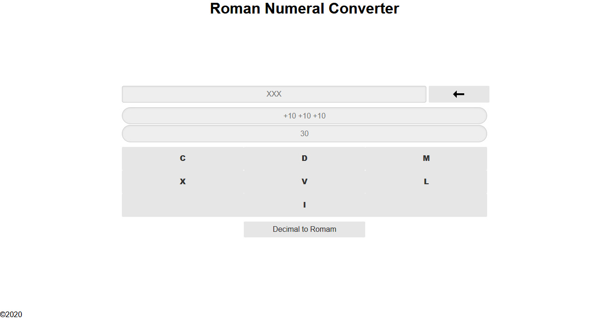
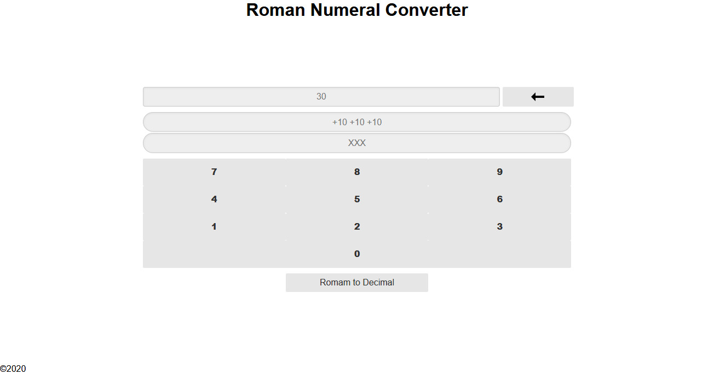

# Roman Numeral Converter

## Descrição

Uma simples aplicação web estática que converte número romano para decimal e decimal para romano

Acesse por https://samuelmarcos-cpu.github.io/Roman-to-Decimal-Converter/

## Visuals

